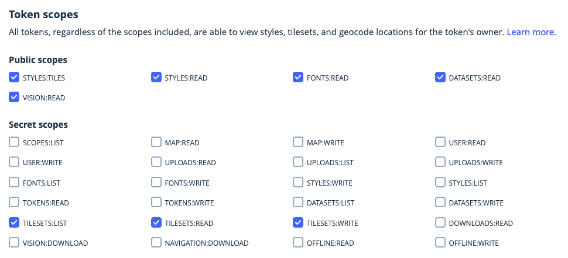
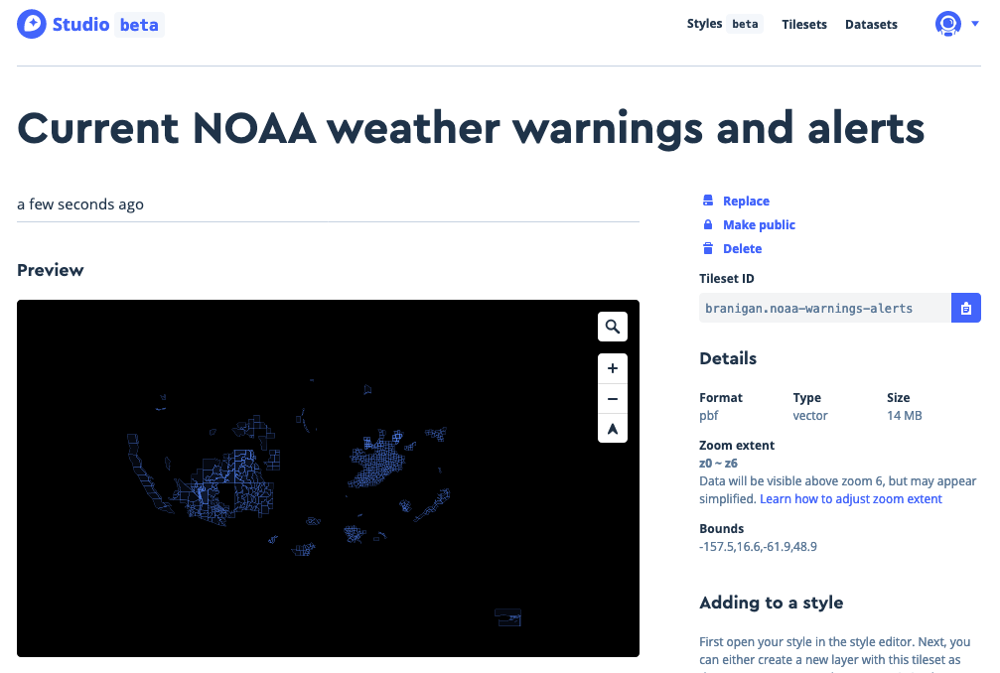

# Mapbox Tiling Service (MTS) Data Sync

Use this tool to publish data directly to the [Mapbox Tiling Service](https://docs.mapbox.com/mapbox-tiling-service/overview/) without writing any code. The tool runs Node.js from the terminal. It may be helpful to use a text editor like VS Code, Sublime Text, or Atom to view and edit “dot” files and recipe files. If you prefer to use Python or if you want more control over how you data pipeline works, check out the [Tilesets CLI](https://docs.mapbox.com/mapbox-tiling-service/overview/#tilesets-cli).

## Installation

MTS Data Sync requires that Node.js and npm are installed. If you don't have Node installed, [nvm](https://github.com/nvm-sh/nvm) is a nice way to manage installation.

1. Clone or download this repo. Unzip the file if needed and move it to your documents or other directory that works for you. In your Terminal application, `cd` into the `mts-data-sync` directory.

2. Install the dependencies with:

`npm install`

3. This application is designed to **run anywhere**, not just the directory where it's installed. This allows for a workflow where you can `cd` into any directory with GeoJSON and work from there. To have the command `mtsds` (MTS data sync) available anywhere, run:

`npm link`

4. Create a secret access token in your [Mapbox.com account](https://account.mapbox.com/access-tokens/). This is different from your normal access tokens, because it has write access to your data. *Don’t use this token in your web apps*. You’ll need to add TILESETS:LIST, TILESETS:READ, and TILESETS:WRITE scopes to this token when you create it. Copy this token to your clipboard after creating it, or keep the page open during the next step. 



5. To complete installation, run:

`mtsds --token`

This will prompt you for your Mapbox username, and then for the secret access token you just created. Confirm what you entered, and your information will be saved to your computer.

## Usage

Prepare your [GeoJSON data](https://docs.mapbox.com/mapbox-tiling-service/overview/tileset-sources/). **This tool converts your standard GeoJSON data to a line-delimited GeoJSON file, the format MTS requires.** This tool does not validate the input GeoJSON, if you are encountering errors, please make sure your GeoJSON data is valid.

There are five commands available:

- `--config filename.geojson`
- `--estimate`
- `--sync`
- `--convert filename.geojson`
- `--token`

In your terminal, `cd` to the directory with your spatial data. The following command will build the configuration and a minimal recipe for your tiling process, and convert your GeoJSON data to line-delimited GeoJSON.

Run `mtsds --config path-to-your.geojson` to generate a .geojsonl file, mts-config.json and mts-recipe.json. Note, when typing your file path and name, you can type the first few letters and press `tab` to autocomplete the file name.

Answer a couple of questions to generate the config and recipe:

`Please enter an ID for your tileset`. This is the [ID you use to access tilesets](https://docs.mapbox.com/help/glossary/tileset-id/) in your account. You don't need to include your username as part of the ID. Tileset IDs are limited to 32 characters, alphanumeric with hyphens and underscores only.

`Please enter a name for your tileset`. This is the pretty name that you'll see on your tileset page in your account. This value is limited to 64 characters, and can include spaces but no special characters.

Example mts-config.json file:

```
{
  "username": "my-username",
  "tilesetSourceId": "tileset-id-src",
  "tilesetSourcePath": "data.geojsonl",
  "tilesetId": "tileset-id",
  "tilesetName": "My tileset on Mapbox.com"
}
```

A [basic recipe](https://docs.mapbox.com/mapbox-tiling-service/overview/tileset-recipes/) example:

```
{
  "version": 1,
  "layers": {
    "tileset-id": {
      "source": "mapbox://tileset-source/my-username/tileset-id-src",
      "minzoom": 0,
      "maxzoom": 5
    }
  }
}
```

You can always change these files later if you want to rename something. 

Note that the recipe is very basic, and defaults to a free-tier, low maximum zoom level of 5. At minimum, you may want to increase that [zoom level to match the detail](https://docs.mapbox.com/mapbox-tiling-service/overview/#precision-levels-and-square-kilometers) of your data.

Open the new mts-recipe.json file in your text editor to customize [how your data should be tiled](https://docs.mapbox.com/mapbox-tiling-service/examples/). This is where you can set the min and max zoom levels, filter data into separate layers, union data at low zoom levels, and much more. 

Before publishing your data, you can estimate the [cost of the processing job](https://docs.mapbox.com/mapbox-tiling-service/overview/#pricing) and tile hosting by running:

`mtsds --estimate`

This will measure the area of tiles that intersect your data at the zoom level Mapbox uses to calculate billing (the minimum zoom level in each pricing band). Note that the estimation process is complex, and runs on your computer. If the data is large or if it covers a large area, and you want to estimate cost for high zoom levels, estimation may take a while. It is also dependent on your available RAM and CPU speed.

This command produces the square kilometers you can use to estimate the cost of the tiling job:

```
counties $ mtsds --estimate
Estimating job size... this could take a while depending on your max zoom
Estimated number of tiles at billing zoom 11: 30,749

Calculating tile area

Tiling 14,542,804 square kilometers in the Tileset Processing 1m tier

Estimated total cost is: $101.08

This estimate does not take into account any prior MTS usage or discount tier.
To get a more accurate pricing estimate, add this area to your past usage this billing cycle.
Total area processed this month is visible at https://account.mapbox.com/statistics.
Input this total value into the MTS pricing calculator (https://www.mapbox.com/pricing/#tilesets)
for a complete price estimate.
```

Once your access token, config file, and recipe are ready, begin the tiling process with:

`mtsds --sync`

The script will print information to the console during the process. If the tiling process succeeds, the script will open the Mapbox Studio page to preview the tileset.

Example of output logged for a successful publishing job:

```
$ mtsds --sync
Preparing tileset source data:: noaa-warnings-alerts-source
Uploading the source data...
Tileset source created: mapbox://tileset-source/branigan/noaa-warnings-alerts-source. Files 1, Size: 14902394 bytes
{ id:
   'mapbox://tileset-source/branigan/noaa-warnings-alerts-source',
  files: 1,
  source_size: 14902394,
  file_size: 14902394 }
Recipe validated
Tileset already exists
[ { type: 'vector',
    id: 'branigan.noaa-warnings-alerts',
    name: 'Current NOAA weather warnings and alerts',
    center: [ -109.6875, 32.779346, 0 ],
    created: '2020-07-07T17:39:13.300Z',
    modified: '2020-07-28T16:03:03.703Z',
    visibility: 'private',
    description: '',
    filesize: 14902394,
    status: 'available' } ]
{ message: 'Processing branigan.noaa-warnings-alerts',
  jobId: 'ckd8ujz1o001c07mfdbnwacw4' }
Status: processing branigan.noaa-warnings-alerts
{ id: 'branigan.noaa-warnings-alerts',
  latest_job: 'ckd8ujz1o001c07mfdbnwacw4',
  status: 'processing' }
Status: processing branigan.noaa-warnings-alerts
{ id: 'branigan.noaa-warnings-alerts',
  latest_job: 'ckd8ujz1o001c07mfdbnwacw4',
  status: 'processing' }
... 
(the above message prints every 10 seconds as the code checks the status
when the processing job is complete, it opens the Studio tileset preview page)
Complete: opening https://studio.mapbox.com/tilesets/branigan.noaa-warnings-alerts/
```

This page will open in your browser:



## Additional Options

This tool is designed to support workflows with data that changes periodically. When your data changes and you want to update your tileset (hence "data sync"), you can use the `--convert file.geojsonl` option. Assuming you modified your file in place, or overwrote it with new data, use this option to convert the GeoJSON to the line-delimited format. Once that's ready, you can use the `--sync` option to republish the data with the same recipe and settings.

If you need to change your secret access token, use the `--token` option to enter a new token.
